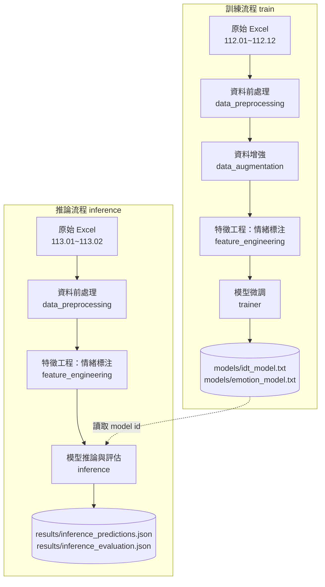

# Medical-Incident-NLP

> 以大型語言模型（LLM）對**醫療異常事件報告**進行自動化分析的研究專案。

本專案針對醫院通報的醫療異常事件文本，建立一條完整的資料處理與模型微調（fine-tuning）流程，並同時訓練兩個 OpenAI 模型來完成兩項任務：

| 任務 | 說明 | 標籤 |
| --- | --- | --- |
| **IDT 歸因分類** | 依據 IDT（Incident Decision Tree，事件決策樹）邏輯，判斷事件根因屬於「個人」或「系統」 | `個人` / `系統` |
| **撰寫者情緒分析** | 推斷事件報告「撰寫者」於書寫當下的情緒 | 中性、焦慮、自責、無奈、擔憂、沮喪、憤怒、驚慌、困惑、警覺 |

---

## 目錄

- [專案特色](#專案特色)
- [系統流程](#系統流程)
- [專案結構](#專案結構)
- [環境需求與安裝](#環境需求與安裝)
- [環境變數設定](#環境變數設定)
- [使用方式](#使用方式)
- [資料格式](#資料格式)
- [模型與評估結果](#模型與評估結果)
- [設計說明與注意事項](#設計說明與注意事項)

---

## 專案特色

- **端到端流程**：從原始 Excel 通報資料，到資料清洗、增強、特徵標注、模型微調與推論評估，全程腳本化。
- **雙任務微調**：以 `gpt-4o-mini-2024-07-18` 為基礎模型，分別微調 IDT 與情緒兩個專用分類模型。
- **IDT 決策樹提示工程**：將完整的 IDT 五階段決策邏輯（刻意傷害 → 能力 → 外部 → 情境 → 補救檢視）寫入 system prompt，引導模型依臨床風險管理框架推理。
- **LLM 資料增強**：透過語意改寫（paraphrase）擴充訓練樣本，提升資料多樣性。

---

## 系統流程

專案分為**訓練（train）**與**推論（inference）**兩條流程，皆由 [run.py](run.py) 統一進入。



| 階段 | 模組 | 功能 |
| --- | --- | --- |
| 1. 前處理 | [src/data_preprocessing.py](src/data_preprocessing.py) | 讀取並合併 Excel 各月份工作表、欄位重命名、僅保留合法 `idt_target`（個人／系統），輸出 JSON |
| 2. 資料增強 | [src/data_augmentation.py](src/data_augmentation.py) | 用 LLM 對事件描述進行語意改寫，擴充訓練資料（僅訓練集） |
| 3. 特徵工程 | [src/feature_engineering.py](src/feature_engineering.py) | 用 LLM 標注每筆描述的「撰寫者情緒」並填入 `emotion_target` |
| 4. 模型訓練 | [src/trainer.py](src/trainer.py) | 將資料轉為 OpenAI fine-tuning 格式並建立微調任務，模型 id 寫入 `models/` |
| 5. 推論評估 | [src/inference.py](src/inference.py) | 用微調模型對測試集預測 IDT 與情緒，計算 accuracy 並輸出結果 |

---

## 專案結構

```text
Medical-Incident-NLP/
├── run.py                      # 流程進入點（train / inference）
├── src/
│   ├── data_preprocessing.py   # 1. Excel → 清洗 → JSON
│   ├── data_augmentation.py    # 2. LLM 語意改寫增強
│   ├── feature_engineering.py  # 3. LLM 情緒標注
│   ├── trainer.py              # 4. 微調 IDT / 情緒模型（含 IDT 決策樹提示）
│   └── inference.py            # 5. 推論與評估
├── models/                     # 微調後的 model id（純文字）
│   ├── idt_model.txt
│   └── emotion_model.txt
├── results/                    # 推論輸出
│   ├── inference_predictions.json
│   └── inference_evaluation.json
├── data/                       # 資料目錄（已加入 .gitignore，不納入版控）
│   ├── raw_data/               # 原始 Excel
│   ├── processed_data/         # 前處理後 JSON
│   └── interim/                # 增強 / 特徵 / 訓練中間檔
├── requirements.txt
└── .env                        # OpenAI 金鑰（已加入 .gitignore，請勿提交）
```

---

## 環境需求與安裝

- Python 3.11+
- 一組可用的 OpenAI API Key（需具備 fine-tuning 權限）

```bash
# 建議使用虛擬環境
python3 -m venv .venv
source .venv/bin/activate

# 安裝相依套件
pip install -r requirements.txt
```

相依套件：`pandas`、`openpyxl`、`openai`、`python-dotenv`。

---

## 環境變數設定

在專案根目錄建立 `.env` 檔，填入你的 OpenAI 金鑰：

```dotenv
OPENAI_API_KEY=sk-your-key-here
```

> ⚠️ `.env` 已列入 `.gitignore`，**請勿將金鑰提交至版本庫**。

---

## 使用方式

> 完整流程需要 `data/raw_data/` 內的原始 Excel 檔。`run.py` 中前處理、增強、特徵工程等步驟預設為註解狀態（中間檔已存在時可略過），實際執行時請依需求取消註解。

### 訓練

執行前處理 → 資料增強 → 情緒標注 → 微調 IDT 與情緒兩個模型：

```bash
python run.py train
```

完成後，微調模型 id 會寫入 `models/idt_model.txt` 與 `models/emotion_model.txt`。

### 推論與評估

對測試集進行前處理 → 情緒標注 → 以微調模型預測並評估：

```bash
python run.py inference
```

結果輸出至：

- `results/inference_predictions.json`：每筆的預測結果（`idt_pred`、`emotion_pred`）
- `results/inference_evaluation.json`：各任務的 accuracy 統計

---

## 資料格式

原始資料來自醫院通報 Excel（去識別化），以民國年月為工作表名稱：

- **訓練集**：`112.01` ~ `112.12`（民國 112 年全年）
- **測試集**：`113.01` ~ `113.02`（民國 113 年 1–2 月）

前處理後每筆記錄的 JSON 結構如下：

```json
{
  "idt_target": "系統",
  "emotion_target": "焦慮",
  "content": {
    "description": "事件描述文字……",
    "directive": "批示內容……"
  }
}
```

| 欄位 | 來源 | 說明 |
| --- | --- | --- |
| `idt_target` | Excel 人工標註（`IDT分析`） | 任務一的真實標籤：`個人` / `系統` |
| `emotion_target` | 模型標注（特徵工程階段） | 任務二的情緒標籤 |
| `content.description` | Excel `事件描述` | 模型輸入的主要文本 |
| `content.directive` | Excel `批示` | 主管批示，保留作為背景資訊 |

---

## 模型與評估結果

以微調模型對測試集（113.01–113.02，共 207 筆）進行評估：

| 任務 | 基礎模型 | 測試樣本 | 正確數 | Accuracy |
| --- | --- | --- | --- | --- |
| IDT 歸因分類 | `gpt-4o-mini-2024-07-18` | 207 | 191 | **92.27%** |
| 撰寫者情緒分析 | `gpt-4o-mini-2024-07-18` | 207 | 146 | **70.53%** |

> 數據來源：[results/inference_evaluation.json](results/inference_evaluation.json)

---

## 設計說明與注意事項

- **IDT 標籤為人工標註**：`idt_target`（個人／系統）取自醫院通報 Excel 的人工判定，屬於真實的金標準（gold label）。
- **情緒標籤由模型標注**：情緒資料並無人工標準答案；`emotion_target` 在訓練集與測試集皆以**相同的標注方式**（特徵工程階段的 LLM 標注）產生。因此情緒任務的 accuracy 反映的是微調模型與標注模型之間的一致性，此為刻意設計。
- **API 成本**：資料增強、情緒標注、微調與推論皆會呼叫 OpenAI API，並產生對應費用，大量資料執行前請留意。
- **資料隱私**：原始資料為去識別化之醫療通報內容，請依所屬機構之資料治理規範使用，切勿將含個資的原始檔案提交至版本庫。
