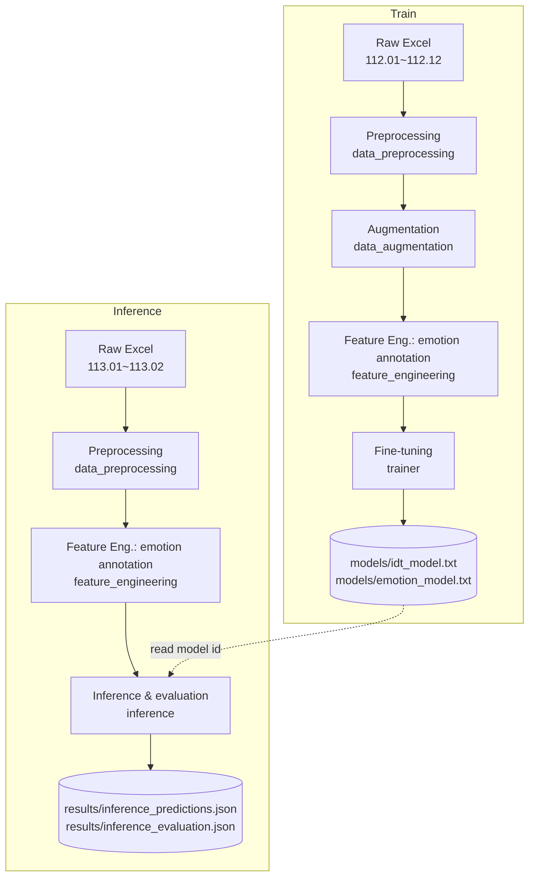

# Medical-Incident-NLP

> A research project that uses Large Language Models (LLMs) to automatically analyze **medical incident reports**.

This project builds an end-to-end data-processing and fine-tuning pipeline for hospital-reported medical incident texts, and fine-tunes two OpenAI models to perform two tasks:

| Task | Description | Labels |
| --- | --- | --- |
| **IDT Root-Cause Classification** | Following the IDT (Incident Decision Tree) logic, decide whether the root cause of an incident is "personal" or "system". | `個人` (Personal) / `系統` (System) |
| **Writer Emotion Analysis** | Infer the emotion of the report's **author** at the moment of writing. | Neutral, Anxious, Self-blame, Helpless, Worried, Frustrated, Angry, Panicked, Confused, Alert |

> Note: the source texts and model labels are in Traditional Chinese; English terms above are provided as glosses.

---

## Table of Contents

- [Features](#features)
- [Pipeline](#pipeline)
- [Project Structure](#project-structure)
- [Requirements & Installation](#requirements--installation)
- [Environment Variables](#environment-variables)
- [Usage](#usage)
- [Data Format](#data-format)
- [Models & Evaluation](#models--evaluation)
- [Design Notes & Caveats](#design-notes--caveats)

---

## Features

- **End-to-end pipeline**: from raw Excel incident reports through data cleaning, augmentation, feature annotation, model fine-tuning, and inference evaluation — all scripted.
- **Two fine-tuned models**: built on `gpt-4o-mini-2024-07-18` as the base model, with separate fine-tuned classifiers for IDT and emotion.
- **IDT decision-tree prompting**: the full five-stage IDT logic (deliberate harm → capability → external → contextual → remedial review) is encoded in the system prompt to guide the model along a clinical risk-management framework.
- **LLM-based data augmentation**: semantic paraphrasing expands the training set and increases data diversity.

---

## Pipeline

The project has two flows — **train** and **inference** — both launched through [run.py](run.py).



| Stage | Module | Function |
| --- | --- | --- |
| 1. Preprocessing | [src/data_preprocessing.py](src/data_preprocessing.py) | Load and merge Excel monthly sheets, rename columns, keep only valid `idt_target` (Personal/System), export JSON |
| 2. Augmentation | [src/data_augmentation.py](src/data_augmentation.py) | Use an LLM to paraphrase incident descriptions, expanding the training set (training set only) |
| 3. Feature Engineering | [src/feature_engineering.py](src/feature_engineering.py) | Use an LLM to annotate the "writer emotion" of each description into `emotion_target` |
| 4. Training | [src/trainer.py](src/trainer.py) | Convert data to the OpenAI fine-tuning format and launch fine-tuning jobs; model ids are written to `models/` |
| 5. Inference | [src/inference.py](src/inference.py) | Predict IDT and emotion on the test set with the fine-tuned models, compute accuracy, and export results |

---

## Project Structure

```text
Medical-Incident-NLP/
├── run.py                      # Entry point (train / inference)
├── src/
│   ├── data_preprocessing.py   # 1. Excel → cleaning → JSON
│   ├── data_augmentation.py    # 2. LLM semantic paraphrasing
│   ├── feature_engineering.py  # 3. LLM emotion annotation
│   ├── trainer.py              # 4. Fine-tune IDT / emotion models (with IDT decision-tree prompt)
│   └── inference.py            # 5. Inference & evaluation
├── models/                     # Fine-tuned model ids (plain text)
│   ├── idt_model.txt
│   └── emotion_model.txt
├── results/                    # Inference outputs
│   ├── inference_predictions.json
│   └── inference_evaluation.json
├── data/                       # Data directory (git-ignored, not version-controlled)
│   ├── raw_data/               # Raw Excel
│   ├── processed_data/         # Preprocessed JSON
│   └── interim/                # Augmented / feature / training intermediates
├── requirements.txt
└── .env                        # OpenAI key (git-ignored, do not commit)
```

---

## Requirements & Installation

- Python 3.11+
- A valid OpenAI API key (with fine-tuning access)

```bash
# A virtual environment is recommended
python3 -m venv .venv
source .venv/bin/activate

# Install dependencies
pip install -r requirements.txt
```

Dependencies: `pandas`, `openpyxl`, `openai`, `python-dotenv`.

---

## Environment Variables

Create a `.env` file in the project root and add your OpenAI key:

```dotenv
OPENAI_API_KEY=sk-your-key-here
```

> ⚠️ `.env` is listed in `.gitignore` — **never commit your key to the repository**.

---

## Usage

> The full pipeline requires the raw Excel file under `data/raw_data/`. In `run.py`, the preprocessing, augmentation, and feature-engineering steps are commented out by default (they can be skipped when the intermediate files already exist); uncomment them as needed.

### Train

Run preprocessing → augmentation → emotion annotation → fine-tune both the IDT and emotion models:

```bash
python run.py train
```

When finished, the fine-tuned model ids are written to `models/idt_model.txt` and `models/emotion_model.txt`.

### Inference & Evaluation

Run preprocessing → emotion annotation → predict and evaluate with the fine-tuned models on the test set:

```bash
python run.py inference
```

Outputs:

- `results/inference_predictions.json`: per-record predictions (`idt_pred`, `emotion_pred`)
- `results/inference_evaluation.json`: per-task accuracy statistics

---

## Data Format

The raw data comes from de-identified hospital incident-report Excel files, with sheets named by year-month in the ROC (Minguo) calendar:

- **Training set**: `112.01` – `112.12` (ROC year 112, full year)
- **Test set**: `113.01` – `113.02` (ROC year 113, Jan–Feb)

After preprocessing, each record has the following JSON structure:

```json
{
  "idt_target": "系統",
  "emotion_target": "焦慮",
  "content": {
    "description": "incident description text…",
    "directive": "supervisor directive…"
  }
}
```

| Field | Source | Description |
| --- | --- | --- |
| `idt_target` | Excel human annotation (`IDT分析`) | Ground-truth label for Task 1: `個人` (Personal) / `系統` (System) |
| `emotion_target` | Model annotation (feature-engineering stage) | Emotion label for Task 2 |
| `content.description` | Excel `事件描述` | Primary text fed to the model |
| `content.directive` | Excel `批示` | Supervisor's directive, kept as background context |

---

## Models & Evaluation

Evaluation of the fine-tuned models on the test set (113.01–113.02, 207 records):

| Task | Base Model | Test Samples | Correct | Accuracy |
| --- | --- | --- | --- | --- |
| IDT Root-Cause Classification | `gpt-4o-mini-2024-07-18` | 207 | 191 | **92.27%** |
| Writer Emotion Analysis | `gpt-4o-mini-2024-07-18` | 207 | 146 | **70.53%** |

> Source: [results/inference_evaluation.json](results/inference_evaluation.json)

---

## Design Notes & Caveats

- **IDT labels are human-annotated**: `idt_target` (Personal/System) comes from the human judgment in the hospital's reporting Excel and serves as the gold label.
- **Emotion labels are model-annotated**: there is no human ground truth for emotion; `emotion_target` is produced by the **same annotation method** (the LLM annotation in the feature-engineering stage) for both the training and test sets. The emotion task's accuracy therefore reflects the agreement between the fine-tuned model and the annotation model — this is by design.
- **API cost**: augmentation, emotion annotation, fine-tuning, and inference all call the OpenAI API and incur cost; mind this before running on large datasets.
- **Data privacy**: the raw data consists of de-identified medical incident reports. Use it in accordance with your institution's data-governance policies, and never commit files containing personal data to the repository.
