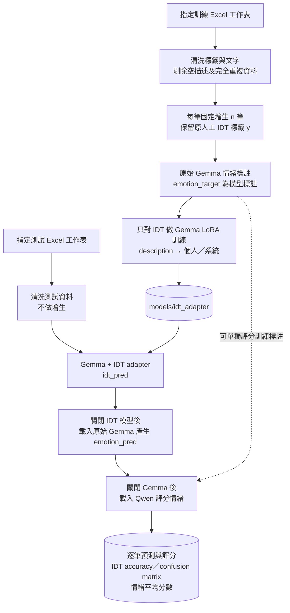

# Medical-Incident-NLP

本專案使用 Hugging Face 本機模型處理醫療事件描述，流程為「資料讀取 → 資料清洗 → 保留 y 的固定資料增生 → Gemma 情緒標註 → Gemma IDT LoRA fine-tuning → 測試集推論與 Qwen 情緒評分」。`y` 指原始人工 IDT 標籤（`個人`／`系統`）；每筆原文固定增加指定數量的改寫，改寫沿用原標籤。

IDT 有人工標籤，因此使用 accuracy 與 confusion matrix 評估。情緒沒有人工標籤，Gemma 產生的情緒交由 Qwen 依文字證據給出 1–5 分與理由。**只訓練 IDT LoRA adapter；情緒標註不做 fine-tuning，也不計算情緒 accuracy。**

| 工作 | 預設模型 | 輸入與輸出 |
| --- | --- | --- |
| 訓練資料改寫 | [google/gemma-4-E2B-it](https://huggingface.co/google/gemma-4-E2B-it) | 改寫 `content.description`，保留人工 `idt_target` |
| 撰寫者情緒標註 | [google/gemma-4-E2B-it](https://huggingface.co/google/gemma-4-E2B-it) | 從事件描述選出一個情緒標籤 |
| IDT LoRA 訓練與推論 | [google/gemma-4-E2B-it](https://huggingface.co/google/gemma-4-E2B-it) + 本專案 adapter | 事件描述 → `個人`／`系統` |
| 情緒品質評分 | [Qwen/Qwen3.5-9B](https://huggingface.co/Qwen/Qwen3.5-9B) | 事件描述 + Gemma 情緒 → 三項分數、平均分與理由 |

## 資料流程


```mermaid
flowchart TD
    A[指定訓練 Excel 工作表] --> B[清洗標籤與文字<br/>剔除空描述及完全重複資料]
    B --> C[每筆固定增生 n 筆<br/>保留原人工 IDT 標籤 y]
    C --> D[原始 Gemma 情緒標註<br/>emotion_target 為模型標註]
    D --> E[只對 IDT 做 Gemma LoRA 訓練<br/>description → 個人／系統]
    E --> F[(models/idt_adapter)]
    G[指定測試 Excel 工作表] --> H[清洗測試資料<br/>不做增生]
    H --> I[Gemma + IDT adapter<br/>idt_pred]
    F --> I
    I --> J[關閉 IDT 模型後<br/>載入原始 Gemma 產生 emotion_pred]
    J --> K[關閉 Gemma 後<br/>載入 Qwen 評分情緒]
    K --> L[(逐筆預測與評分<br/>IDT accuracy／confusion matrix<br/>情緒平均分數)]
    D -.可單獨評分訓練標註.-> K
```

模型只使用 `content.description` 作為事件文字。`content.directive`（批示）保留在資料中，未送入改寫、標註、IDT 訓練／推論或情緒評分的模型輸入。

| 階段 | 實作 | 行為 |
| --- | --- | --- |
| 讀取與清洗 | [src/data_preprocessing.py](src/data_preprocessing.py) | 讀取指定月份工作表、整理欄名與文字，正規化 IDT 標籤，剔除非法標籤、空描述及相同標籤／描述／批示的完全重複資料，保留來源識別碼 |
| 固定資料增生 | [src/data_augmentation.py](src/data_augmentation.py) | 每筆新增 `n` 個非空、互異且不與已知描述完全相同的改寫，複製原人工 IDT 標籤；版本不足時重試，仍不足則中止 |
| 情緒標註 | [src/feature_engineering.py](src/feature_engineering.py) | 使用原始 Gemma 產生 `emotion_target`，記錄模型來源及 `emotion_annotation_is_gold=false` |
| IDT LoRA 訓練 | [src/trainer.py](src/trainer.py) | 以人工 `idt_target` 做 supervised fine-tuning，僅 assistant 分類標籤與結束 token 計入 loss，儲存 adapter、tokenizer 與訓練資訊 |
| 測試集推論 | [src/inference.py](src/inference.py) | 分別使用 IDT adapter 與原始 Gemma 產生 `idt_pred`、`emotion_pred`，再使用 Qwen 評分情緒 |
| 獨立評分 | [src/evaluation.py](src/evaluation.py) | 對已產生的 `emotion_pred` 或 `emotion_target` 重新評分，無須載入 Gemma；有有效 IDT 預測與人工標籤時同步整理 IDT 評估 |

清洗後若有 `N` 筆訓練資料，預設 `--augment-n 2` 會保留原文並新增 `2N` 筆，合計 `3N` 筆。測試集不增生。改寫提示詞要求保留醫療事實、因果、角色責任及不確定性；程式可驗證格式、數量、重複情形與標籤是否沿用，改寫是否完整保留語意仍需研究者抽查。

資料筆數不固定。每次讀取更新後的 Excel，清洗流程會依實際內容回報輸入筆數、非法 IDT 標籤、空描述、重複資料及輸出筆數。

## 環境與安裝

使用 Python 3.11 以上。既有 conda `py311` 環境可直接安裝：

```bash
conda activate py311
python -m pip install -r requirements.txt
```

也可建立一般虛擬環境：

```bash
python3.11 -m venv .venv
source .venv/bin/activate
python -m pip install -r requirements.txt
```

[requirements.txt](requirements.txt) 包含 `pandas>=2.0`、`openpyxl>=3.1`、`torch>=2.4`、`transformers>=5.10.1,<6`、`peft>=0.19.0,<1`、`accelerate>=1.1.0` 與 `sentencepiece>=0.2`。Transformers 與 PEFT 的下限參考 [Google 的 Gemma Hugging Face fine-tuning 教學](https://ai.google.dev/gemma/docs/core/huggingface_text_finetune_qlora)。本專案實作為 LoRA，未啟用該教學中的 4-bit QLoRA 量化。

模型與 tokenizer 由 Hugging Face `from_pretrained` 載入。本專案只處理文字，因此使用 `AutoTokenizer` 的原生 chat template，模型由 `AutoModelForMultimodalLM` 載入；不初始化影像／音訊 processor。需要模型存取授權時，可使用 Hugging Face 標準的 `HF_TOKEN` 環境變數：

```bash
export HF_TOKEN="你的 Hugging Face token"
```

程式未載入 `.env`。公開模型或已下載的本機模型可依存取需求決定是否設定 token。`--gemma-model` 與 `--judge-model` 也接受本機模型目錄；完整模型已在本機時可加入 `--local-files-only`，禁止模型下載。

```bash
python run.py all --device cuda \
  --gemma-model /path/to/gemma-4-E2B-it \
  --judge-model /path/to/Qwen3.5-9B \
  --local-files-only
```

`--device auto` 依序選擇 CUDA、MPS、CPU。`--device cuda` 會在 CUDA 不可用時明確失敗。真實訓練與 9B 模型評分應在資源足夠的 GPU 伺服器上執行；模型會依序載入及釋放，避免 IDT Gemma、情緒 Gemma 與 Qwen 同時占用記憶體。LoRA 訓練使用單一裝置，CUDA 推論允許 Accelerate 自動分配模型。

## 使用方式

所有命令由專案根目錄執行。原始 Excel 預設放在 `data/raw_data/raw data去辨識0612.xlsx`，也可使用 `--raw-file /path/to/file.xlsx` 指定檔案。必要欄位為 `IDT分析(個人,系統)`、`事件描述`、`批示`。預設訓練工作表是 `112.01`–`112.12`，測試工作表是 `113.01`、`113.02`；資料更新時，以 `--train-sheets`、`--test-sheets` 指定新月份。

查看命令與參數：

```bash
python run.py --help
```

### 完整流程

```bash
python run.py all --device cuda
```

依序完成訓練資料讀取／清洗、每筆新增 2 筆改寫、Gemma 情緒標註、IDT LoRA 訓練、測試資料讀取／清洗、IDT／情緒推論與 Qwen 評分。指定的資料輸出、adapter 及 results 路徑會產生新結果或更新已有檔案；需要分開保存實驗時，使用不同的 `--models-dir` 和 `--out-dir`。

更新原始資料及月份時，可以改用下列命令；範例月份需替換成檔案中實際存在的工作表。訓練與測試工作表不可重疊，CLI 會在執行前檢查。

```bash
python run.py all --device cuda \
  --raw-file /path/to/updated_incidents.xlsx \
  --train-sheets 114.01 114.02 114.03 \
  --test-sheets 115.01 115.02 \
  --models-dir models/updated_experiment \
  --out-dir results/updated_experiment
```

### 分階段執行

| 模式 | 執行內容 |
| --- | --- |
| `prepare` | 訓練集讀取／清洗 → 固定增生 → Gemma 情緒標註 |
| `train` | `prepare` → IDT LoRA 訓練 |
| `inference` | 測試集讀取／清洗 → IDT adapter 推論 → 原始 Gemma 情緒標註 → Qwen 評分 |
| `evaluate` | 讀取既有標註／預測，使用 Qwen 評分情緒 |
| `all` | `train` → `inference` |

先完成資料準備，再重用準備好的 `train_features.json` 訓練：

```bash
python run.py prepare --device cuda --augment-n 2
python run.py train --device cuda --reuse-prepared
```

直接執行 `train` 會重新執行資料準備：

```bash
python run.py train --device cuda
```

`--augment-n 0` 表示不新增改寫，仍對原文進行情緒標註及後續 IDT 訓練。

adapter 訓練完成後，執行測試集推論與評分：

```bash
python run.py inference --device cuda
```

重用已清洗的 `test_data.json`，略過測試 Excel 讀取：

```bash
python run.py inference --device cuda --reuse-prepared
```

`--reuse-prepared` 在 `train` 中重用 `--train-features`，在 `inference` 中重用 `--test-data`；在 `all` 中同時套用這兩個行為。重用檔案時，請確認內容及情緒標註來源符合這次實驗設定。

### 推論與情緒評分分開執行

先完成 Gemma 推論，再單獨載入 Qwen：

```bash
python run.py inference --device cuda --skip-emotion-evaluation
python run.py evaluate --device cuda
```

`evaluate` 預設讀取 `--out-dir/inference_predictions.json`，預設評分欄位為 `emotion_pred`。如果 Qwen 輸出格式或分數無效，程式重試後仍失敗會明確中止；Gemma 已完成的預測會保存在 predictions 檔案，評估檔會標記情緒尚未評分，可使用 `evaluate` 重試。

訓練集的 Gemma `emotion_target` 也可以單獨評分。以下命令將訓練標註評分寫入獨立目錄，保留測試集結果：

```bash
python run.py evaluate --device cuda \
  --evaluation-input data/interim/train_features.json \
  --prediction-field emotion_target \
  --out-dir results/train_emotion
```

### 檢查設定但不執行

```bash
python run.py all --device cuda --dry-run
python run.py train --device cuda --reuse-prepared --dry-run
```

`--dry-run` 列出執行階段、模型、訓練設定與路徑，不讀取原始資料、不下載模型、不訓練及不寫入檔案。它不會檢查模型存取權、GPU 是否可用、資料檔內容或 adapter 相容性。

## 主要設定

設定定義於 [src/config.py](src/config.py)，完整 CLI 參數可由 `python run.py --help` 查看。

| 參數 | 預設值 | 用途 |
| --- | --- | --- |
| `--augment-n` | `2` | 每筆原文新增的改寫數 |
| `--train-sheets`／`--test-sheets` | `112.01`–`112.12`／`113.01`、`113.02` | 指定原始 Excel 的訓練／測試工作表，接受多個名稱 |
| `--gemma-model` | `google/gemma-4-E2B-it` | 改寫、情緒標註及 IDT 訓練的基礎模型 |
| `--judge-model` | `Qwen/Qwen3.5-9B` | 情緒評分模型 |
| `--device`／`--dtype` | `auto`／`auto` | 執行裝置與模型精度 |
| `--seed` | `42` | 隨機種子 |
| `--max-new-tokens` | `1024` | 模型生成的最大 token 數 |
| `--epochs` | `3.0` | IDT 訓練 epochs |
| `--batch-size` | `1` | 每個裝置的訓練 batch size |
| `--gradient-accumulation-steps` | `8` | 梯度累積次數 |
| `--learning-rate` | `2e-4` | IDT 訓練學習率 |
| `--max-length` | `4096` | 訓練完整對話的 token 上限，包含 IDT system prompt |
| `--lora-rank`／`--lora-alpha`／`--lora-dropout` | `8`／`16`／`0.05` | LoRA 設定 |

LoRA 預設只訓練文字模型 `language_model` 下的 `q_proj`、`v_proj` adapter，避免將影像及音訊層納入。gradient checkpointing 預設開啟，可用 `--no-gradient-checkpointing` 關閉。樣本超過 `--max-length` 時會明確失敗，要求提高上限；程式不截斷事件描述或 assistant 分類標籤。IDT adapter 載入時會檢查其基礎模型是否與 `--gemma-model` 一致。Qwen 評分生成的 token 上限至少為 512，以容納三項分數與理由。

## 資料格式與輸出

以下為合成示例，用來說明資料格式：

```json
{
  "idt_target": "系統",
  "emotion_target": "中性",
  "content": {
    "description": "已記錄流程並完成通報。",
    "directive": "持續檢視作業流程。"
  },
  "record_id": "112.01:2",
  "source_id": "112.01:2",
  "is_augmented": false,
  "augmentation": null,
  "emotion_annotation_model": "google/gemma-4-E2B-it",
  "emotion_annotation_source": "llm_generated",
  "emotion_annotation_is_gold": false
}
```

| 欄位 | 意義 |
| --- | --- |
| `idt_target` | Excel 既有人工 IDT 標籤，是 IDT 訓練與評估的目標 |
| `emotion_target` | 清洗階段先留空，準備階段由 Gemma 產生；名稱保留既有格式，但內容是模型標註 |
| `record_id` | 單筆資料識別碼；增生版本包含 `:aug:版本號` |
| `source_id` | 原始工作表與 Excel 列號；改寫保留相同來源，以追蹤原文與增生的關係 |
| `is_augmented`／`augmentation` | 是否為改寫，以及改寫方法、模型、版本 |
| `idt_pred` | Gemma IDT LoRA adapter 的分類預測 |
| `emotion_pred` | 原始 Gemma 對測試描述重新產生的情緒標籤，未使用 IDT adapter |
| `emotion_judge` | Qwen 的逐筆三項分數、平均分、評分理由與評審模型來源 |

合法情緒標籤為：`中性`、`焦慮`、`自責`、`無奈`、`擔憂`、`沮喪`、`憤怒`、`驚慌`、`困惑`、`警覺`。標註聚焦撰寫者書寫當下的情緒，不能以病人或其他當事者的情緒替代。模型標籤／JSON 無效時會重試後中止，不使用「中性」填補模型失敗。

| 預設路徑 | 內容 |
| --- | --- |
| `data/processed_data/train_data.json` | 清洗後訓練資料 |
| `data/interim/train_augmented.json` | 原文與固定數量改寫 |
| `data/interim/train_features.json` | Gemma 情緒標註與來源資訊 |
| `data/interim/idt_train.jsonl` | IDT supervised fine-tuning 的對話樣本 |
| `data/processed_data/test_data.json` | 清洗後測試資料 |
| `models/idt_adapter/` | LoRA adapter、tokenizer、checkpoint 與 `training_metadata.json` |
| `results/inference_predictions.json` | 逐筆 IDT／情緒預測、模型來源及 `emotion_judge` |
| `results/inference_evaluation.json` | IDT 與情緒評估的 task summary list |

訓練 metadata 保留模型、參數、樣本數、資料與 IDT prompt 的 SHA-256 及訓練 metrics，方便核對實驗來源。CLI 支援 `--train-data`、`--train-augmented`、`--train-features`、`--test-data`、`--models-dir`、`--out-dir` 覆寫預設路徑。

資料 JSON 的讀寫統一由 [src/json_io.py](src/json_io.py) 處理，讀取時驗證最外層為紀錄陣列、每筆為物件，並拒絕 `NaN`／`Infinity`。寫入時先完整序列化，再用同目錄暫存檔原子替換，避免格式或寫入失敗截斷既有結果；此保障以單一檔案為單位。訓練情緒標註與 Qwen 評分會等整批成功後才回填記憶體中的資料，失敗時保留原有標註或評分。

## 評估方式與目前驗證狀態

IDT 只比較有效的人工 `idt_target`（`個人`／`系統`）與 `idt_pred`，輸出樣本數、正確筆數、accuracy 及 confusion matrix；confusion matrix 的列為人工標籤、欄為預測標籤。缺少有效人工標籤的資料不進入 accuracy 分母。

情緒沒有人工真值。Qwen 只看到事件描述與待評分情緒，依下列面向評分：

| 分數欄位 | 面向 |
| --- | --- |
| `emotion_plausibility` | 情緒是否符合文字語氣與內容 |
| `evidence_support` | 是否有文字證據支持，避免以事件嚴重程度推測情緒 |
| `writer_perspective` | 是否聚焦撰寫者，而非病人、家屬或其他當事者 |

每項分數必須是 1–5 的有限數值。`overall_score` 為三項算術平均；summary 保留 `mean_scores` 和 `mean_overall_score`，逐筆 `rationale` 說明文字證據與限制。這些是模型評審的品質分數，不能稱為情緒 accuracy，也不能把 `emotion_target` 當成情緒 gold label。

專案既有的 `models/idt_model.txt`、`models/emotion_model.txt` 與先前 `results/` 內容屬舊 OpenAI 流程產物。新程式不讀取這兩個模型 ID 檔案；既有 OpenAI accuracy 也不是本次 Gemma／Qwen 流程的結果。新流程必須實際執行後才會產生新的 IDT metrics 和 Qwen 分數，本文件不提供尚未執行的成績。

測試使用合成資料與假模型，驗證清洗、增生數量與來源、訓練資料／loss mask、標籤與分數驗證、IDT 評估及模型依序釋放：

```bash
PYTHONDONTWRITEBYTECODE=1 python -m unittest discover -s tests -v
```

測試中的小模型 LoRA smoke test 使用 2 筆合成資料與隨機初始化的微型模型，驗證訓練、adapter 儲存及重新載入，不下載大型模型；缺少 `peft`／`accelerate` 等所需依賴時會標記 skip。mock tests、小模型測試與 `--dry-run` 都不能替代完整 Gemma 訓練或 Qwen 評分。本次開發的本機環境沒有可用 CUDA／MPS，未啟動正式資料流程，也尚未執行大型真實模型訓練與推論。

## 程式品質檢查

[pyproject.toml](pyproject.toml) 設定 Python 3.11、100 字元的格式化行寬，以及語法、未使用名稱、import 順序與 Python 語法更新檢查。Ruff 為開發工具，可另外安裝後執行：

```bash
python -m pip install ruff
python -m ruff check run.py src tests
python -m ruff format --check run.py src tests
```

修改格式可執行 `python -m ruff format run.py src tests`。設定會排除 `_old/`；執行測試時使用上方的 `PYTHONDONTWRITEBYTECODE=1`，避免更新已存在的 Python bytecode。新增註解以資料來源、失敗處理、模型記憶體與 loss mask 的設計理由為主，型別與流程本身能表達的操作不重複註解。
